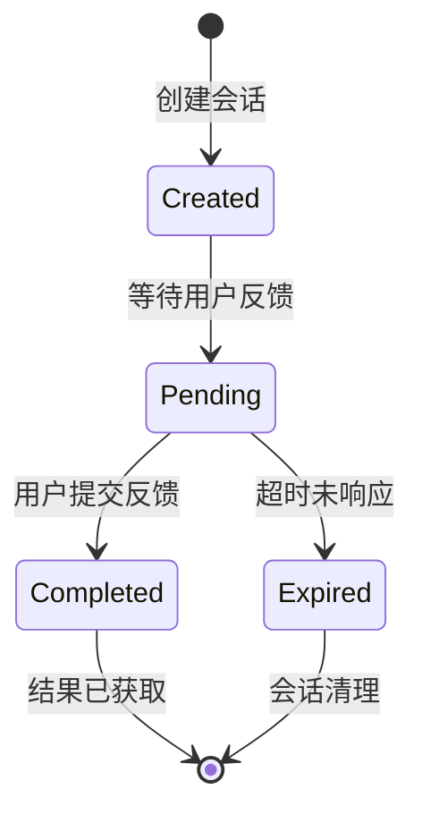

# Cloudflare Workers 架构设计

## 概述

本文档描述了如何将 Interactive Feedback MCP 项目适配到 Cloudflare Workers 环境中，实现基于 Web 的交互式反馈功能。

## 架构对比

### 原始架构 (桌面版)
- **MCP 服务器**: 本地运行的 FastMCP 服务器
- **GUI 界面**: PySide6 桌面应用程序
- **进程通信**: 子进程 + 临时文件
- **数据存储**: 本地临时文件
- **用户交互**: 桌面 GUI 窗口

### Cloudflare Workers 架构
- **Workers API**: 边缘计算 HTTP API 服务
- **Web 界面**: HTML/CSS/JS 响应式网页
- **通信机制**: RESTful API + WebSocket (可选)
- **数据存储**: Cloudflare KV + Durable Objects
- **用户交互**: Web 浏览器界面

## 核心组件设计

### 1. Workers API 服务

**主要职责**:
- 处理反馈会话创建请求
- 生成和管理会话 ID
- 提供 Web 反馈界面
- 处理反馈提交和状态查询
- 管理会话超时和清理

**技术特性**:
- 全球边缘部署，低延迟响应
- 无服务器架构，自动扩缩容
- 支持 HTTP/HTTPS 和 WebSocket
- 集成 Cloudflare 安全防护

### 2. Web 反馈界面

**界面特性**:
- 响应式设计，支持移动端
- 现代化 UI，类似原版 GUI 体验
- 支持预定义选项和自由文本输入
- 实时验证和提交状态反馈
- 支持键盘快捷键 (Ctrl+Enter)

**技术实现**:
- 纯前端 HTML/CSS/JavaScript
- 无需额外框架依赖
- 支持暗色主题
- 渐进式增强设计

### 3. 数据存储层

#### Cloudflare KV 存储
**用途**: 存储会话数据和反馈结果
```
Key 格式: session:{sessionId}
Value 结构: {
  "prompt": "用户提示信息",
  "predefinedOptions": ["选项1", "选项2"],
  "status": "pending|completed|expired",
  "feedback": "用户反馈内容",
  "createdAt": "2024-01-01T00:00:00Z",
  "expiresAt": "2024-01-01T01:00:00Z"
}
```

#### Durable Objects
**用途**: 管理会话状态和实时通信
- 处理会话超时逻辑
- 管理 WebSocket 连接
- 协调多个并发请求
- 提供强一致性保证

### 4. 通信机制

#### HTTP API 通信
- **同步模式**: 适用于快速反馈场景
- **轮询模式**: 定期查询反馈状态
- **超时处理**: 自动处理长时间无响应

#### WebSocket 通信 (核心功能)
- **实时通知**: 即时反馈提交通知，无需轮询
- **状态同步**: 实时会话状态更新和推送
- **连接管理**: 自动重连和错误处理
- **App 支持**: 为移动端 App 提供长连接支持
- **多端同步**: 支持多个客户端同时监听同一会话

## 数据流设计

### 反馈请求流程

1. **会话创建**
   ```
   AI 助手 → POST /api/feedback/create
   {
     "message": "需要用户确认的问题",
     "predefinedOptions": ["选项1", "选项2"],
     "timeout": 300
   }
   ```

2. **会话响应**
   ```
   Workers API → AI 助手
   {
     "sessionId": "uuid-v4",
     "feedbackUrl": "https://feedback.example.com/session/uuid-v4",
     "statusUrl": "https://feedback.example.com/api/feedback/uuid-v4/status"
   }
   ```

3. **用户交互**
   ```
   用户访问 feedbackUrl → 显示反馈界面 → 提交反馈
   ```

4. **结果获取**
   ```
   AI 助手轮询 statusUrl → 获取反馈结果
   ```

### 会话状态管理



## 技术优势

### 性能优势
- **全球边缘部署**: 就近响应，降低延迟
- **自动扩缩容**: 无需容量规划
- **高可用性**: 99.9% 可用性保证
- **CDN 加速**: 静态资源全球缓存

### 开发优势
- **无服务器**: 无需服务器运维
- **版本控制**: 支持灰度发布
- **监控告警**: 内置性能监控
- **安全防护**: DDoS 和 WAF 保护

### 成本优势
- **按需付费**: 仅为实际使用付费
- **免费额度**: 每日 100,000 请求免费
- **无固定成本**: 无服务器租赁费用

## 限制和约束

### Cloudflare Workers 限制
- **CPU 时间**: 单次请求最多 50ms (付费版 50s)
- **内存限制**: 128MB 内存上限
- **请求大小**: 100MB 请求体限制
- **并发连接**: WebSocket 连接数限制

### 功能限制
- **无本地存储**: 无法访问本地文件系统
- **无子进程**: 无法启动外部程序
- **网络限制**: 仅支持 HTTP/WebSocket 出站连接

### 解决方案
- **状态外化**: 使用 KV 和 Durable Objects 存储状态
- **异步处理**: 使用事件驱动架构
- **分片处理**: 大任务拆分为小任务
- **缓存优化**: 合理使用缓存减少计算

## 安全考虑

### 会话安全
- **UUID 会话 ID**: 防止会话 ID 猜测
- **会话过期**: 自动清理过期会话
- **访问控制**: 基于会话 ID 的访问控制

### 数据安全
- **HTTPS 传输**: 全程加密传输
- **数据脱敏**: 敏感信息不记录日志
- **访问日志**: 记录访问行为用于审计

### 防护机制
- **速率限制**: 防止 API 滥用
- **DDoS 防护**: Cloudflare 内置防护
- **WAF 规则**: Web 应用防火墙保护

## 部署架构

### 环境划分
- **开发环境**: 用于功能开发和测试
- **预发环境**: 用于集成测试和验收
- **生产环境**: 用于正式服务提供

### 域名规划
- **API 域名**: `api.feedback.example.com`
- **Web 域名**: `feedback.example.com`
- **监控域名**: `monitor.feedback.example.com`

### 资源配置
- **Workers 脚本**: 主要业务逻辑
- **KV 命名空间**: 数据存储
- **Durable Objects**: 状态管理
- **自定义域名**: 品牌化访问地址

## 项目文档索引

本项目包含以下详细文档：

1. **[API 接口设计](./api-design.md)** - 完整的 RESTful API 规范
2. **[实施计划](./implementation-plan.md)** - 详细的开发计划和技术选型
3. **[功能对比分析](./comparison.md)** - 与原版 MCP 的全面对比

## 快速开始

### 前置要求
- Node.js 18+ 和 npm
- Cloudflare 账户
- Wrangler CLI 工具

### 基础设置
```bash
# 安装 Wrangler CLI
npm install -g wrangler

# 登录 Cloudflare
wrangler login

# 创建项目
wrangler init cloudflare-workers-feedback

# 配置 KV 存储
wrangler kv:namespace create "FEEDBACK_KV"
```

### 开发环境
```bash
# 本地开发
wrangler dev

# 运行测试
npm test

# 部署到开发环境
wrangler publish --env dev
```
